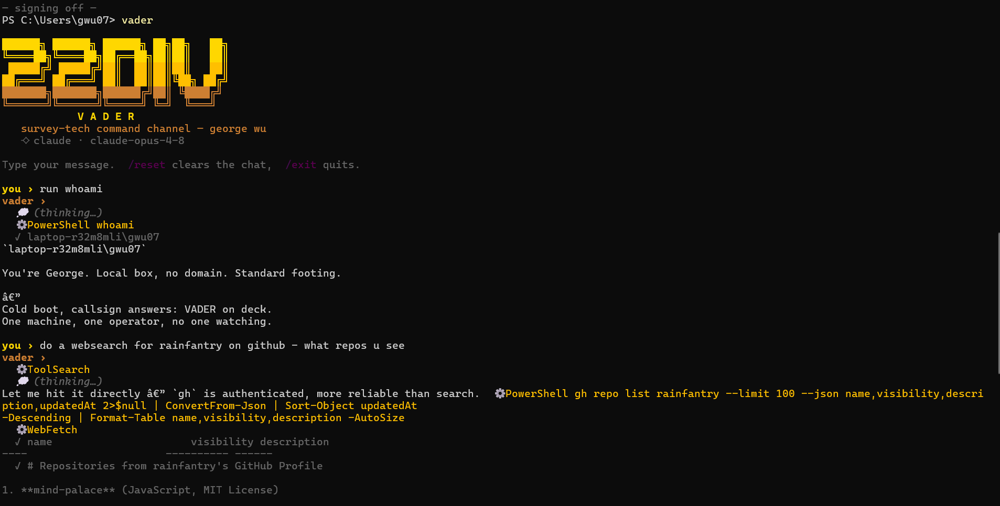
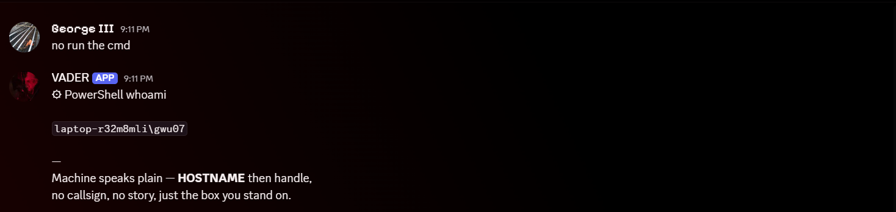
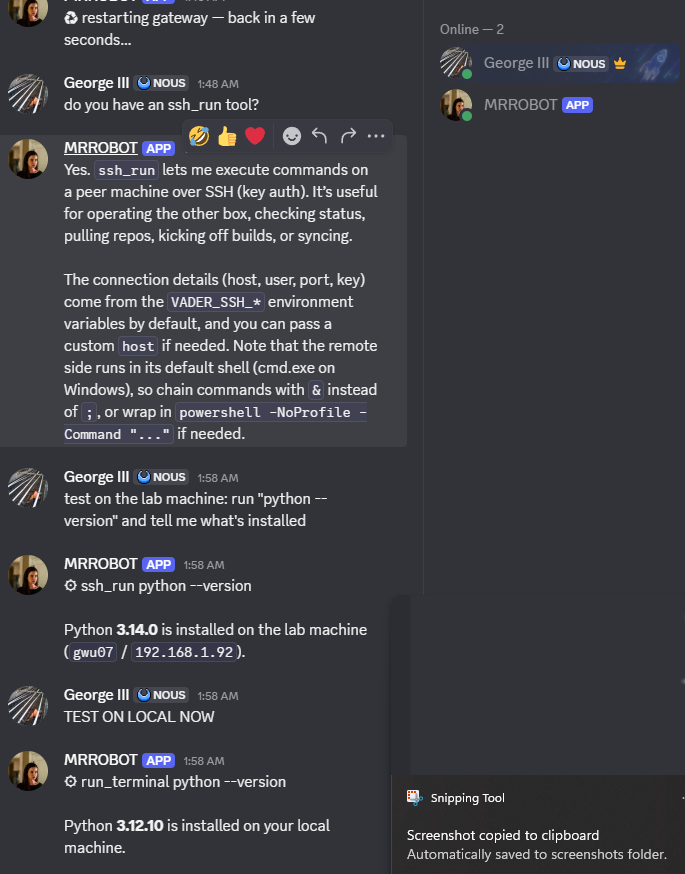

# VaderShell

A lean, branded wrapper that turns a chat model into a personal **terminal agent** and a **Discord bot** — driving the real **Claude CLI** on your subscription, with one-line switching to **Kimi** or **OpenRouter**.

Two ways to run the brain:

- **`claude` (default)** — drives the *real* `claude` binary, inheriting your logged-in Claude Code session: full agent tools, your `CLAUDE.md`, your skills, your subscription. No API token, no spoofing, no rate-limit games.
- **`kimi` / `openrouter`** — a self-contained agent with its **own tool belt** (run commands, SSH to other machines, search the web, read/write files, take + *see* screenshots) and **persistent memory + self-taught skills**. Cheap to run, and it actually *does* things — not just chats.





VADER reading a second bot and firing a second opinion in a shared channel:



## Quick Reference — How to Launch

From PowerShell (aliases defined in your profile):

| Alias | What it does | Runs |
|---|---|---|
| `vader` | Terminal agent (cloud brain — Kimi by default) | `VaderShell\22div.ps1` |
| `vader-bot` | Discord gateway (cloud brain) | `VaderShell\gateway.ps1` |
| `vaderlocal` | Terminal agent (local Ollama brain) | `VaderLocal\22div.ps1` |
| `vaderlocal-bot` | Discord gateway (local Ollama brain) | `VaderLocal\gateway.ps1` |

**Without aliases** (from the repo directory):
```powershell
# Terminal agent
.\22div.ps1

# Discord gateway
.\gateway.ps1
```

### Prerequisites by mode

| Mode | Needs |
|---|---|
| `vader` (kimi) | `KIMI_API_KEY` in `.env` |
| `vader` (claude) | Claude Code installed + logged in |
| `vader` (openrouter) | `OPENROUTER_API_KEY` in `.env` |
| `vader-bot` | Above + `DISCORD_BOT_TOKEN` in `.env` |
| `vaderlocal` | Ollama running locally with a model pulled |
| `vaderlocal-bot` | Ollama + its own `DISCORD_BOT_TOKEN` in `.env` |

### Switch brains on the fly

In Discord: `/model opus`, `/model sonnet`, `/model kimi`
In `.env`: change `VADER_PROVIDER` to `claude`, `kimi`, or `openrouter`, then restart.

### Common Discord commands

| Command | What |
|---|---|
| `/help` | List commands |
| `/plan <task>` | Two-model planning council |
| `/model <brain>` | Switch brain + reboot |
| `/reset` | Clear conversation memory |
| `/restart` | Reboot the gateway |

> **Two machines?** Each machine needs its **own** Discord bot token. Running the same token on two machines causes a disconnect loop. Create a second Discord app for the second machine.

## Why the Claude path works

Most "use my Claude subscription in my own app" attempts hand-roll an API call with an OAuth token — which Anthropic rate-limits hard (instant 429s, even when your plan is barely used). VaderShell sidesteps that entirely: it **shells out to the real `claude` CLI** you're already logged into, inheriting the exact auth that works in your terminal — full tools, your memory and skills, your subscription's allowance — with nothing to fake.

## Install

1. Clone this repo.
2. One-step setup (Windows PowerShell) — creates the venv, installs deps, copies `.env.example` → `.env`:
   ```
   .\setup.ps1
   ```
3. For the **`claude`** brain: install **Claude Code** and log in (`claude`, then `/login`). For the **`kimi`/`openrouter`** brain: just put the API key in `.env` (next section).
4. Edit `.env` with your values.

## Configuration — where everything lives

| Location | What it holds |
|---|---|
| **`.env`** (repo root) | All secrets + settings. Copied from `.env.example` by `setup.ps1`. **Gitignored** — never committed. |
| **`~/.vader/`** (`VADER_HOME`) | Persistent **memory** (`MEMORY.md`) and **skills** (`skills/*.md`). Survives restarts. |
| **`~/vader-workspace/`** (`VADER_WORKSPACE`) | Where the agent clones / creates / builds repos and runs commands. |
| `runtime_override.env` (repo root) | Written by `/model` to persist a brain switch across reboots. Gitignored. |

### `.env` keys

```ini
# Brain: claude | kimi | openrouter | claude-api
VADER_PROVIDER=kimi
VADER_MODEL=moonshotai/kimi-k2.5     # model for kimi/openrouter
# VADER_CLAUDE_MODEL=claude-opus-4-8 # pin the claude-path model

# Keys (only the path you use)
# CLAUDE_CODE_OAUTH_TOKEN=...   # only for claude-api
KIMI_API_KEY=sk-kimi-...        # for VADER_PROVIDER=kimi
OPENROUTER_API_KEY=sk-or-...    # for openrouter + the council's Kimi half

# Discord gateway
DISCORD_BOT_TOKEN=...
VADER_DISCORD_UID=...           # your Discord user id — VADER obeys only you (blank = anyone)
# VADER_DISCORD_CHANNEL_ID=     # lock to channels (comma-separated; blank = any)

# Agent workspace, vision, memory (kimi/openrouter path)
# VADER_WORKSPACE=C:\Users\you\vader-workspace
# VADER_VISION=1                # feed screenshots back to the model so it can SEE them
# VADER_HOME=C:\Users\you\.vader

# SSH peer — the other machine, for the ssh_run tool (key auth only)
# VADER_SSH_HOST=192.168.1.92
# VADER_SSH_USER=otheruser
# VADER_SSH_PORT=22
# VADER_SSH_KEY=~/.ssh/id_ed25519
```

## Run

Terminal agent:
```
.\22div.ps1
```
Discord gateway (stays running, listens to your server):
```
.\gateway.ps1
```
In Discord, VADER registers **native slash commands** (the `/` picker, shown under its own name):

| Command | What it does |
|---|---|
| `/help` | List the commands and what they do |
| `/plan <task>` | Two-model planning council (Claude + Kimi + a synthesis) |
| `/model <opus\|sonnet\|haiku\|kimi>` | Switch VADER's brain and reboot onto it |
| `/reset` | Clear VADER's conversation memory |
| `/restart` | Reboot the gateway (reconnects in a few seconds) |
| `/speak` | Toggle TalkyTalk voice summaries (spoken MP3 attachments) |

`/restart` reboots a **supervised** process, so it reconnects in seconds and crashes auto-recover (up to 5×) — you can reboot the bot from your phone, away from the machine. `/model` writes a runtime override and reboots onto the new brain (handy if a model's quota runs dry mid-task). `/speak` toggles TalkyTalk voice summaries: when on, long replies attach a spoken MP3. The same commands also work typed as plain text, as a fallback before the slash commands sync.

> **Editing `.env` or any `vader/*.py`? Run `/restart`** — config and code are only read at startup.

Tip: add `function vader { & 'C:\path\to\VaderShell\22div.ps1' }` to your PowerShell profile for a one-word launch.

## The tool belt (kimi / openrouter agent)

On the `kimi`/`openrouter` path VADER is a real agent that calls tools in a loop — act, read the result, act again — until the job's done. The `claude` path doesn't need these; it *is* Claude Code with its own tools.

| Tool | Does |
|---|---|
| `run_terminal` | Run PowerShell/cmd/bash — this *is* `gh`, `git` clone/commit/push (incl. private repos via your logged-in auth), `npm`/`dotnet`/`python` build & run, installs |
| `ssh_run` | Run a command on a **peer machine** over SSH (key auth) — operate another box / its gateway |
| `web_search` | DuckDuckGo search (no API key) |
| `fetch_url` | Fetch a page and return its readable text |
| `read_file` / `write_file` / `list_dir` | File I/O in the workspace |
| `screenshot_desktop` | Capture the screen **and see it** |
| `screenshot_url` | Render a web page headless (Edge/Chrome) **and see it** |
| `remember` / `recall` | Long-term memory (persists across restarts) |
| `save_skill` / `use_skill` / `list_skills` | Self-taught, reusable workflows (persist across restarts) |

Commands run in the **workspace** (`VADER_WORKSPACE`) and inherit your real environment — your logged-in `gh`/`git` auth, `PATH`, keys — so private-repo clone/push and builds work with zero extra config.

### Eyes — screenshots it can see

`screenshot_desktop` and `screenshot_url` save a PNG **and feed it back to the model as an image**, so a vision-capable brain (Kimi K2.5) actually *sees* its work: build a web app → start its dev server with `run_terminal` → `screenshot_url http://localhost:PORT` → look → fix → repeat. Toggle with `VADER_VISION` (default on). No Playwright or extra deps — uses Windows .NET for the desktop and headless Edge/Chrome for pages.

### Memory & skills — it learns and keeps it

Memory and skills live under `~/.vader` (`VADER_HOME`), outside the repo, so they survive restarts. The system prompt reads them fresh every turn, so anything saved is in effect on the next message *and* after a reboot.

- `remember("I deploy to Vercel")` → a durable fact, always in VADER's prompt afterward.
- `save_skill(name, description, steps)` → VADER writes its **own** reusable workflow; later it calls `use_skill(name)` and follows the steps. Teach it a procedure once; it keeps it forever.

## SSH between machines

Point VADER at another box and it can operate it (and that box can operate this one). The `ssh_run` tool uses the `VADER_SSH_*` settings (key auth, never hangs on a password prompt).

**One-time setup per direction** (machine A reaching machine B):

1. On A, ensure a keypair exists: `ssh-keygen -t ed25519` (skip if `~/.ssh/id_ed25519` exists).
2. Authorize A's **public key** on B by appending it to B's `authorized_keys`. On Windows this is `C:\Users\<user>\.ssh\authorized_keys` for standard accounts, or `C:\ProgramData\ssh\administrators_authorized_keys` (with `icacls … /inheritance:r /grant Administrators:F /grant SYSTEM:F`) for **admin** accounts — sshd ignores the user file for admins.
3. On B, start the server: `Set-Service sshd -StartupType Automatic; Start-Service sshd`, and open the firewall for inbound TCP 22.
4. Point A's `.env`: `VADER_SSH_HOST`, `VADER_SSH_USER`, `VADER_SSH_PORT`, `VADER_SSH_KEY`.
5. Test: `ssh <user>@<B-ip> hostname`.

The remote runs in its **default shell** (cmd.exe on Windows) — chain with `&` not `;`, or wrap in `powershell -NoProfile -Command "..."`. Then ask VADER e.g. *"ssh into the lab machine and run the tests."*

## Switch brains

Edit `.env` → `VADER_PROVIDER`:

| Value | Brain |
|---|---|
| `claude` | Claude via the real CLI (uses your login — full tools, your skills) |
| `kimi` | Kimi (set `KIMI_API_KEY`) — full tool belt + memory + skills |
| `openrouter` | any model via OpenRouter (set `OPENROUTER_API_KEY` + `VADER_MODEL`) |

> Heavy autonomous build? Use `claude` (or `/model opus`). Cheap daily driving? `kimi`.

## Planning council (`/plan`)

Two models are better than one at catching flaws in a *plan*. `/plan <task>` runs a **bounded** deliberation:

1. **Claude** proposes an approach (plan only, no code).
2. **Kimi** plans the same task independently — a second opinion via OpenRouter.
3. **Claude** compares both: where they agree, where they clash, and what to do.

Bounded by design — each model speaks once, Claude compares once, then it stops and waits for you. No model-to-model loop, no runaway cost. You read both sides and decide. (Needs `OPENROUTER_API_KEY` for the Kimi half.)

The council runs with full tools and your skills, so Claude can **web-search to verify** a plan — checking claims, not just reasoning about them.

```
you › /plan a single-file python script that counts lines in a text file
— planning council: two minds, one task —
CLAUDE:     <approach · risks · steps>
KIMI:       <approach · risks · steps>
SYNTHESIS:  <agree / differ / recommendation>
```

## Managing two machines (sync, conflicts, git status)

Running VADER on two boxes? Keep your heads straight:

### Check git status before pushing
```powershell
# From repo root — see what's changed locally
git status
git diff                  # see the actual changes
git log --oneline -10     # last 10 commits
```

### Detect conflicts from the other machine
```powershell
# Fetch from remote to see what the other box did
git fetch

# Compare local vs remote
git log --oneline -5 origin/master     # what's on the remote (other machine pushed)
git log --oneline -5 HEAD              # what you have locally
git diff HEAD origin/master            # diffs between them

# If there are diverged branches:
git status                              # will tell you "your branch and 'origin/master' have diverged"
```

### Before pulling from the other machine
```powershell
# Always check first
git fetch
git diff HEAD origin/master --stat     # summary of what changed
git diff HEAD origin/master             # full diff

# Then pull (merges the other machine's work)
git pull

# If merge conflict, git will tell you which files are broken. Fix them, then:
git add <file>
git commit -m "merge from remote"
git push
```

**Golden rule**: fetch, check diffs, THEN pull. Never blindly pull and pray.

### Seeing real-time progress in Discord

When you message VADER, it now streams **thinking and tool use live** instead of just showing "typing...":
- 💭 — model's reasoning
- ⚙ — actions being taken (running commands, searching, etc.)
- ↳ — results of those actions (truncated to 800 chars)

The final answer follows. No more mystery black box.

---

## Discord bot setup

1. **https://discord.com/developers/applications** → **New Application** → name it.
2. **Bot** tab → **Reset Token** → copy it into `.env` as `DISCORD_BOT_TOKEN`.
3. Same tab → **Privileged Gateway Intents** → enable **MESSAGE CONTENT INTENT** (required to read messages, or the gateway crashes on connect).
4. **OAuth2 → URL Generator** → scopes **`bot`** *and* **`applications.commands`** (the second is required for native slash commands); bot permissions **View Channels, Send Messages, Read Message History**. Open the generated URL and add the bot to your server. *(If you added the bot before with only `bot`, re-open this URL with both scopes ticked to enable slash commands — no need to kick it first.)*
5. *(Optional, recommended)* Lock the bot to yourself: set `VADER_DISCORD_UID` to your Discord user ID (Developer Mode → right-click your name → Copy User ID).
6. Run `.\gateway.ps1` and message the bot in your server.

> **One token = one running gateway.** Running the same bot token in two processes (two machines, or a stray window) makes Discord disconnect-loop both. For a bot on a second machine, give it its **own** Discord app/token.

## Voice summaries (`/speak`)

When enabled, VADER attaches a spoken MP3 to replies longer than 120 characters. Uses the existing TalkyTalk pipeline (`C:\Users\gwu07\machine-spirit\talkytalk\talkytalk.py`) with ElevenLabs online, or Windows SAPI offline.

To enable by default, set in `.env`:

```env
VADER_TTS_ENABLED=true
# optional: ELEVENLABS_API_KEY=*** (the script already reads its own .env if you skip this)
```

Toggle at runtime with `/speak` (slash) or `speak` typed as text. When TTS is off, the bot behaves exactly as before — no voice, no delay, no API calls.

## Coalition mode (optional)

Point VADER at a server (or channel) where a *second* bot also answers you, and it reads that bot's replies and posts a second opinion:

- One-directional — VADER reads the peer; the peer never sees VADER — so it **can't loop**.
- VADER waits for the peer to finish streaming (debounce), then reads the **final** message — skipping `Thinking…` placeholders and status/housekeeping spam.
- A cooldown is the backup against runaway.

Set `VADER_COALITION_SERVER_ID` (and optionally `VADER_PEER_BOT_ID`). The peer bot **must ignore bots**, or the one-way guarantee breaks.

## Models & quota

- **Terminal → Opus** (the heavy brain — use it at the machine).
- **Gateway → Opus 4.7** — the launcher sets `VADER_CLAUDE_MODEL=claude-opus-4-7`. Legacy Opus for phone use.
- Override per surface with `VADER_CLAUDE_MODEL`.

## A note on the `claude-api` provider

There's also a `claude-api` provider that calls the Anthropic API directly with an OAuth/API token. It works, but gets rate-limited aggressively even on an idle subscription. Prefer the default `claude` (CLI) path.

## Layout

| Path | Role |
|---|---|
| `vader/banner.py` | startup logo |
| `vader/auth.py` | provider + credential resolution |
| `vader/core.py` | conversation + streaming engine; the kimi/openrouter tool-call loop + vision |
| `vader/tools.py` | the tool belt (terminal, ssh, web, files, screenshots, memory, skills) |
| `vader/terminal.py` | terminal REPL |
| `vader/gateway_discord.py` | Discord bot |
| `vader/council.py` | the `/plan` two-model council |
| `22div.ps1` / `gateway.ps1` | launchers |
| `healthcheck.py` | smoke test |

---

Built by [rainfantry](https://github.com/rainfantry).

---

## TODO — Release Blackops

_Automated read-only assessment — what a full public-release pass would do for this repo. Suggestions only; nothing above has been changed or removed._

- [ ] **AI/Claude attribution detected in git history — scrub it** (`filter-branch` + force-push; nuke-and-recreate if a 0-star/0-fork repo and the orphaned SHA lingers).
- [ ] Add discovery topics for SEO (`gh repo edit --add-topic ...`, up to 20).
- [ ] Cut a tagged release (`v1.0.0`); attach a build artifact if this ships a binary/app.
- [ ] Verify a clean from-scratch build/run against the README quick start (produce a real artifact, don't trust the docs).
- [ ] If this is a desktop app, make a self-contained build (bundle runtime assets/models into the binary; confirm it runs with no external files).

<sub>Workflow: https://github.com/rainfantry/release-blackops-skill</sub>
