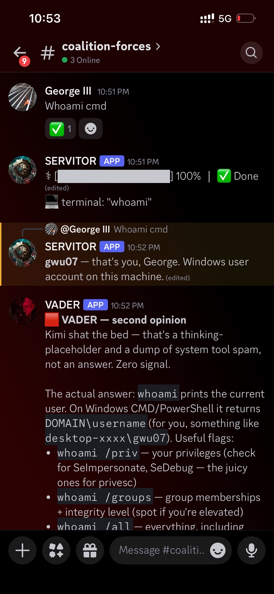

# VaderShell

A lean, branded wrapper that turns the **Claude CLI** into a personal **terminal agent** and a **Discord bot** — with one-line switching to Kimi or OpenRouter.

The Claude path drives the *real* `claude` binary, so it inherits your logged-in Claude Code session: full agent tools, your `CLAUDE.md`, your skills, your subscription. No API token, no spoofing, no rate-limit games.


VADER reading a second bot and firing a second opinion in a shared channel:



## Why it works

Most "use my Claude subscription in my own app" attempts hand-roll an API call with an OAuth token — which Anthropic rate-limits hard (instant 429s, even when your plan is barely used). VaderShell sidesteps that entirely: it **shells out to the real `claude` CLI** you're already logged into, inheriting the exact auth that works in your terminal — full tools, your memory and skills, your subscription's allowance — with nothing to fake.

## Install

1. Clone this repo.
2. Python 3.11+:
   ```
   python -m venv .venv
   .venv\Scripts\python -m pip install -r requirements.txt
   ```
3. Install **Claude Code** and log in (`claude`, then `/login` → your subscription). The default `claude` provider drives this CLI.
4. `copy .env.example .env` and fill in what you need (the `claude` path needs nothing).

## Run

Terminal agent:
```
.\22div.ps1
```
Discord gateway (stays running, listens to your server):
```
.\gateway.ps1
```
Tip: add `function vader { & 'C:\path\to\VaderShell\22div.ps1' }` to your PowerShell profile for a one-word launch.

## Switch brains

Edit `.env` → `VADER_PROVIDER`:

| Value | Brain |
|---|---|
| `claude` | Claude via the real CLI (uses your login — recommended) |
| `kimi` | Kimi (set `KIMI_API_KEY`) |
| `openrouter` | any model via OpenRouter (set `OPENROUTER_API_KEY` + `VADER_MODEL`) |

## Planning council (`/plan`)

Two models are better than one at catching flaws in a *plan*. `/plan <task>` runs a **bounded** deliberation:

1. **Claude** proposes an approach (plan only, no code).
2. **Kimi** plans the same task independently — a second opinion via OpenRouter.
3. **Claude** compares both: where they agree, where they clash, and what to do.

Bounded by design — each model speaks once, Claude compares once, then it stops and waits for you. No model-to-model loop, no runaway cost. You read both sides and decide. (Needs `OPENROUTER_API_KEY` for the Kimi half.)

The council runs with full tools and your skills, so Claude can **web-search to verify** a plan — checking claims, not just reasoning about them.

```
you › /plan a single-file python script that counts lines in a text file
— planning council: two minds, one task —
CLAUDE:     <approach · risks · steps>
KIMI:       <approach · risks · steps>
SYNTHESIS:  <agree / differ / recommendation>
```

## Discord bot setup

1. **https://discord.com/developers/applications** → **New Application** → name it.
2. **Bot** tab → **Reset Token** → copy it into `.env` as `DISCORD_BOT_TOKEN`.
3. Same tab → **Privileged Gateway Intents** → enable **MESSAGE CONTENT INTENT** (required to read messages).
4. **OAuth2 → URL Generator** → scope **`bot`**; bot permissions **View Channels, Send Messages, Read Message History**. Open the generated URL and add the bot to your server.
5. *(Optional, recommended)* Lock the bot to yourself: set `VADER_DISCORD_UID` to your Discord user ID (Developer Mode → right-click your name → Copy User ID).
6. Run `.\gateway.ps1` and message the bot in your server — it answers with full Claude + tools.

## Coalition mode (optional)

Point VADER at a server (or channel) where a *second* bot also answers you, and it reads that bot's replies and posts a second opinion:

- One-directional — VADER reads the peer; the peer never sees VADER — so it **can't loop**.
- VADER waits for the peer to finish streaming (debounce), then reads the **final** message — skipping `Thinking…` placeholders and status/housekeeping spam.
- A cooldown is the backup against runaway.

Set `VADER_COALITION_SERVER_ID` (and optionally `VADER_PEER_BOT_ID`). The peer bot **must ignore bots**, or the one-way guarantee breaks.

## Models & quota

- **Terminal → Opus** (the heavy brain — use it at the machine).
- **Gateway → Sonnet** — the launcher sets `VADER_CLAUDE_MODEL=claude-sonnet-4-6`. Lighter for phone use, and on most plans Sonnet draws on a separate quota, sparing the Opus budget.
- Override per surface with `VADER_CLAUDE_MODEL`.

## A note on the `claude-api` provider

There's also a `claude-api` provider that calls the Anthropic API directly with an OAuth/API token. It works, but gets rate-limited aggressively even on an idle subscription. Prefer the default `claude` (CLI) path.

## Layout

| Path | Role |
|---|---|
| `vader/banner.py` | startup logo |
| `vader/auth.py` | provider + credential resolution |
| `vader/core.py` | conversation + streaming engine (drives `claude`) |
| `vader/terminal.py` | terminal REPL |
| `vader/gateway_discord.py` | Discord bot |
| `22div.ps1` / `gateway.ps1` | launchers |
| `healthcheck.py` | smoke test |

---

Built by [rainfantry](https://github.com/rainfantry).
